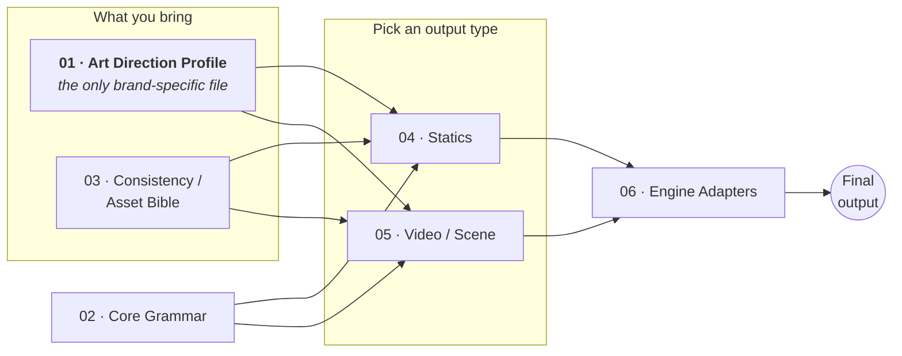

# Art Direction Engine

**A brand-blind toolset for generating consistent, non-generic statics and videos with AI image and video engines.**

Most AI image prompting fails the same two ways: the output looks like *everyone else's* AI output (high-saturation, centred hero, plastic gloss), and the product / character / world drifts between shots so a series never looks like a series. The Art Direction Engine fixes both — it separates **the look** (a swappable brand file) from **the mechanics** (how a prompt is built, how an asset stays identical, how a scene holds across angles, how each engine wants its syntax), so you can retarget the whole system to any brand by changing one document.

It works whether a human follows it or you load it into an LLM (Claude Project, Gemini Gem, custom GPT) as an operating contract.

> **New here? → Read [START_HERE.md](START_HERE.md) first.** It's the 10-minute on-ramp. This README is the map.

---

## The core idea

> **One swappable file.** The only thing that changes per brand is the **Art Direction Profile** (Doc 01). Everything else stays constant. Swap the Profile and the whole system retargets.

Four kinds of thing, kept separate so you can always reach for the right part:

- **Art direction** = data you plug in (the Profile, Doc 01).
- **Mechanics** = fixed and brand-neutral (Grammar 02, Consistency 03).
- **Output type** = a module you pick (Statics 04, Video 05).
- **Engine** = a final translation step (Engine Adapters 06).

The rule that makes it modular: **every fact lives in exactly one document.** Palette lives only in the Profile; the scale method lives only in the Grammar; a product's true dimensions live only in its Asset Bible entry. Modules reference each other, they don't restate.

---

## How the pieces fit

Everything rests on **01** (the look) and **02** (the grammar). Both output modules draw asset-locking from **03**. **06** is always the last step. The upstream **01A · Creation Guide** is how you *invent* a strong Profile in the first place.

---

## The run sequence

1. **Invent or load a Profile** for your brand (use the [Creation Guide, 01A](docs/01A_Art_Direction_Creation_Guide.md), fill the [Template, 01](docs/01_Art_Direction_Profile_TEMPLATE.md)).
2. **Pick an output type:** a static ([04](docs/04_Statics_Module.md)) or a video scene ([05](docs/05_Video_Scene_Module.md)).
3. **Lock any recurring product/character** via its Asset Bible entry ([03](docs/03_Consistency_and_Asset_Bible.md)).
4. **Assemble the prompt** with the Core Grammar ([02](docs/02_Core_Prompt_Grammar.md)), pulling brand values from 01 and asset facts from 03.
5. **Translate to your chosen engine** with the Engine Adapters ([06](docs/06_Engine_Adapters.md)).
6. **Deliver** per the runnable-output contract in [Doc 00](docs/00_System_Operating_Contract.md).

---

## Repo map

| Path | What it is |
|---|---|
| **[START_HERE.md](START_HERE.md)** | First-time on-ramp — read this first |
| **[SETUP.md](SETUP.md)** | Build-your-own walkthrough: create a Profile, set up the assistant, run your first job |
| [docs/00_System_Operating_Contract.md](docs/00_System_Operating_Contract.md) | How it all runs + how an AI assistant must behave |
| [docs/01_Art_Direction_Profile_TEMPLATE.md](docs/01_Art_Direction_Profile_TEMPLATE.md) | **The swappable brand file** — copy and fill this |
| [docs/01A_Art_Direction_Creation_Guide.md](docs/01A_Art_Direction_Creation_Guide.md) | How to *invent* a distinctive, non-generic art direction |
| [docs/02_Core_Prompt_Grammar.md](docs/02_Core_Prompt_Grammar.md) | Brand-neutral prompt mechanics (layers, negative space, scale) |
| [docs/03_Consistency_and_Asset_Bible.md](docs/03_Consistency_and_Asset_Bible.md) | Keeping a product/character identical across outputs |
| [docs/04_Statics_Module.md](docs/04_Statics_Module.md) | One static, or a series sharing an asset |
| [docs/05_Video_Scene_Module.md](docs/05_Video_Scene_Module.md) | Multi-shot scenes, camera angles, continuity |
| [docs/06_Engine_Adapters.md](docs/06_Engine_Adapters.md) | Per-engine syntax + how each holds consistency |
| [examples/](examples/) | A complete fictional brand worked end-to-end |
| [assets/](assets/) | Drop your own example renders here (see its README) |

The 7 sequential modules (00–06) plus the 01A Creation Guide are the whole toolset. They're brand-neutral; nothing in this repo is tied to a real client.

---

## See it work: the Ember & Comb example

The best way to understand the system is to read a complete output. [`examples/`](examples/) contains a fictional craft hot-honey brand, **Ember & Comb**, taken all the way through:

- **[profile_EmberAndComb.md](examples/profile_EmberAndComb.md)** — what a filled Profile looks like, with the Creation-Guide rationale that produced it.
- **[worked_reel_EmberAndComb.md](examples/worked_reel_EmberAndComb.md)** — a full, runnable video deliverable built from that Profile (the stills-first loop, ready to hand to a non-technical operator).

Everything in `examples/` is invented for teaching. Your own brand work stays out of the repo (see [.gitignore](.gitignore)).

---

## Using it with an LLM

Load Docs 00–03 and 06 (plus your filled Profile) into an assistant's persistent knowledge, add 04 or 05 depending on what you make, and give it the short system prompt in [Doc 00 §5](docs/00_System_Operating_Contract.md). **[SETUP.md](SETUP.md) is the full step-by-step** — including a copy-paste system prompt and per-platform instructions for Claude Projects, custom GPTs, and Gemini Gems.

### Typography: type-in-frame or background-only

The system supports both putting words *on* the image and leaving clean space for copy you add later — for stills and video. You record brand type in the Profile (Field 13) and pick a **copy mode** per job: **Reserve** (leave in-palette negative space; composite the real font in post — the default and most accurate) or **Render** (the engine sets an approximate headline in-image via a text-capable engine). Logos and legal text are always composited. → [Grammar §3a](docs/02_Core_Prompt_Grammar.md)

---

## A note on the engine list

The model landscape changes monthly. [Doc 06](docs/06_Engine_Adapters.md) reflects a mid-2026 snapshot (Nano Banana Pro, Gemini Omni, Flux 2 Pro, Midjourney V7, etc.) and flags itself as needing re-verification before a major campaign. The *method* is engine-agnostic; only the syntax adapters date.

---

## License

Intended for release into the public domain (**CC0**). Attribution isn't required, but it's appreciated. No `LICENSE` file is committed yet; add one via your repo host's license picker if you want it formalized.

## Maintainer & contact

Created and maintained by **Usama Bin Shahid**.

Questions, suggestions, or anything you'd like to say about the system — reach out at **usamasq@gmail.com**.

## Contributing

This is a methodology, not code — improvements that make the docs clearer, more brand-blind, or better at resisting generic output are welcome. Keep the "every fact in one document" rule, and keep any new examples fictional. Open an issue or email the maintainer above.
