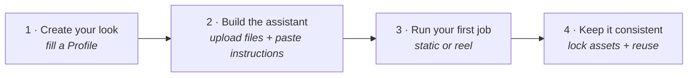

# Build Your Own AI Art Director — Setup Guide

This guide takes a **non-technical person from zero to a working AI art-direction assistant** in about 30 minutes. You'll (1) create your brand's look, (2) load the system into an AI assistant, and (3) run your first image and video. No coding required.

> New to the whole idea? Read [START_HERE.md](START_HERE.md) first for the 10-minute mental model, then come back here to build.



---

## What you need

- **One AI assistant that supports custom instructions + file uploads.** Any of:
  - **Claude** — Projects (claude.ai)
  - **ChatGPT** — a custom GPT (Plus/Team)
  - **Gemini** — a Gem *(or skip setup and try the [ready-made public Gem](https://gemini.google.com/gem/1CeNFZPOSowKmL3AuqklvStldXLLgCl2b?usp=sharing) — see [Step 2](#step-2--build-the-assistant))*
- **The image/video tools you'll actually generate in** (the assistant writes the prompts; you paste them into these). Current picks are in [docs/06_Engine_Adapters.md](docs/06_Engine_Adapters.md) — e.g. Nano Banana Pro for stills, Gemini Omni for video.
- **The files in this repo** (the `docs/` folder).

---

## Step 1 · Create your brand's look (the Profile)

The **Profile** is the one file that makes the system *yours*. There are two ways to make it.

**Option A — let the assistant build it (easiest).** After Step 2, paste into your assistant:
> *"Act as the Creation Guide (Doc 01A). Propose 3 distinct art directions for my brand: [one or two lines about the brand — what it is, who it's for, what's true about it]."*

Pick the one you like, then: *"Produce the filled Profile (Doc 01) for that direction."* Save the result as `01_Profile_YourBrand.md`.

**Option B — fill it by hand.** Open [docs/01_Art_Direction_Profile_TEMPLATE.md](docs/01_Art_Direction_Profile_TEMPLATE.md), copy it, and fill every field. Use [docs/01A_Art_Direction_Creation_Guide.md](docs/01A_Art_Direction_Creation_Guide.md) to keep it distinctive instead of generic. Compare against the finished [examples/profile_EmberAndComb.md](examples/profile_EmberAndComb.md).

**What matters most:** Field 2 (Reject → Target) and your *signature device* — the one repeatable visual move that makes the brand recognizable. If a line could be pasted into a competitor's profile unchanged, it's not specific enough yet. Fill **Field 13 (Typography)** if you'll ever put words on the image.

---

## Step 2 · Build the assistant

The idea is identical on every platform: **create an assistant → give it the knowledge files → paste the system instructions.**

### Files to upload (the assistant's "knowledge")
- **Always:** `docs/00`, `docs/02`, `docs/03`, `docs/06`
- **Your look:** `01_Profile_YourBrand.md` (from Step 1)
- **What you make:** `docs/04` (statics) and/or `docs/05` (video)
- **Optional reference:** the two `examples/` files

### Claude — Projects
1. **claude.ai → Projects → New project.**
2. Open **Project knowledge** → upload the files above.
3. Paste the **system instructions** (below) into **Project instructions**.
4. Start a chat inside the project.

### ChatGPT — custom GPT
1. **ChatGPT → Explore GPTs → Create.**
2. In **Configure**, upload the files under **Knowledge**.
3. Paste the **system instructions** into **Instructions**.
4. Save it as **private** (only you).

### Gemini — Gems

> **Shortcut — try a ready-made Gem.** A public Gem is already set up with the core engine files (Docs 00, 02, 03, 06 + the Statics/Video modules) and the Ember & Comb example Profile (`01_…`) loaded: **[Art Direction Engine Gem](https://gemini.google.com/gem/1CeNFZPOSowKmL3AuqklvStldXLLgCl2b?usp=sharing)**. Open it to see the system run immediately, no setup. Note it is **public and editable by anyone**, so treat it as a shared demo — its files may change or drift over time. For real brand work, build your own Gem (steps below) with your *private* Profile so nothing you load is shared with or altered by others.

1. **Gemini → Gems → New Gem.**
2. Add the files as **knowledge** (upload).
3. Paste the **system instructions** into the instructions box.
4. Save.

### The system instructions (copy this exactly)

```
You are my AI Art Director. You run the Art Direction Engine from your knowledge files.
Follow the Operating Contract in Doc 00: clean deliverable by default (no QC or rationale
unless I say "show your work"), return 2–3 variants for stills and a full shot list for
video, honor the active Profile's drift-watch, and format syntax for the ONE engine you
recommend. Output must be clean, paste-ready text — never leak citation tags, source
markers, or broken code fences into a prompt.

Pull the look from my Art Direction Profile (Doc 01), the build rules from the Core
Grammar (Doc 02), and asset-locking from the Asset Bible (Doc 03). Ask me only for: which
brand Profile, what output type, which assets must stay consistent, and — for any
copy-bearing job — the COPY MODE: "Reserve" (leave in-palette negative space; I composite
the type in post in the real brand font — the default) or "Render" (you set the headline
in-image in an emulated brand type via a text-capable engine, per Doc 02 §3a and Profile
Field 13). Logos and legal text are always composited, never engine-rendered.

If a brief is thin, propose 2–3 distinct directions (or ask 2–3 questions) before locking
a scene. Before sending any VIDEO, silently run the Doc 00 §4.8 pre-flight: shot budget
fits the clip cap; copy maps only onto frames that reserve space; every hero object has a
scale anchor; anchors and asset names are worded consistently; an emotional/lifestyle
brief includes a person. Format every multi-part deliverable to be runnable by a
non-technical operator (Doc 00 §4.1a): a short "How to run this" header, each paste-able
prompt in a marked block naming its model + attachments, the Scene Sheet/ledger tagged
"don't paste," a numbered Step sequence, and the copy/QC notes at the end.
```

---

## Step 3 · Run your first job

Start a chat and just ask. Examples:

- **A single static:** *"Profile = YourBrand. Make me a feed static for [product/idea]. Background only."*
  → returns 2–3 engine-ready prompt variants. Paste one into your image tool.
- **A static series:** *"…a 6-post series for [product], with the product locked across all of them."*
- **A video reel:** *"…a 9:16 reel for [thing], about 10 seconds."*
  → returns a full **runnable Step 1–5 deliverable** (like [examples/worked_reel_EmberAndComb.md](examples/worked_reel_EmberAndComb.md)). Follow it top-to-bottom: make the reference images, the master frame, each still, then animate.

If your brief is vague, expect the assistant to **ask 2–3 questions or propose directions first** — that's intended, not a bug.

---

## Typography: type-in-frame vs background-only

Tell the assistant which **copy mode** you want (it defaults to Reserve if you don't say):

| You want… | Say | What happens |
|---|---|---|
| Just a clean image to add text to later | **"Background only"** / **Reserve** | The image leaves an in-palette empty area; you set the headline in your real brand font in Canva / Photoshop / a video editor. **Most accurate** — and required for logos, legal lines, and Arabic/non-Latin. |
| The words baked into the image by the AI | **"Type-in-frame"** / **Render** | The AI writes the headline into the image in an *approximate* version of your brand type. Good for quick English concepts. The font won't exactly match your brand font, and logos still get added in post. |

This works for **both stills and video**. For video in Render mode, the headline is baked into the **still frames** (not generated by the video model, which mangles live text), then animated. Moving/kinetic type is an editing-app job. Full detail: [docs/02_Core_Prompt_Grammar.md](docs/02_Core_Prompt_Grammar.md) §3a and Profile Field 13.

---

## Step 4 · Keep it consistent over time

- **Keep your filled Profiles private.** Drop them in this repo's `private/` folder (it's gitignored) or keep them outside the repo, so client work never publishes.
- **Lock recurring products/characters** with an Asset Bible entry + a reference sheet ([docs/03](docs/03_Consistency_and_Asset_Bible.md)). Build the sheet once, reuse it forever.
- **Once a look is locked,** fill Field 12 (style-lock handles) in your Profile and reuse the same seed / style-reference across the whole campaign.

---

## Troubleshooting

| Symptom | Fix |
|---|---|
| Output looks generic / like default AI | Your Profile leaned on adjectives. Redo Field 2 and Field 11 with concrete sensory decisions ([01A](docs/01A_Art_Direction_Creation_Guide.md) Phase 5 — the swap test + adjective audit). |
| The product changes between shots | You're generating from text each time. Make a reference sheet and derive every frame from one master frame ([Doc 03](docs/03_Consistency_and_Asset_Bible.md)). |
| It dumped a confusing wall of text | Say *"clean deliverable, runnable format."* The assistant should open with "How to run this" and number the steps ([Doc 00 §4.1a](docs/00_System_Operating_Contract.md)). |
| Text in the image is garbled | Switch to **Background only** (composite the type yourself), or use a text-capable engine for Render mode ([Doc 06](docs/06_Engine_Adapters.md)). |
| The background is a flat white box | That's a failure — negative space must be an in-palette part of the scene ([Doc 02 §3](docs/02_Core_Prompt_Grammar.md)). Tell it to re-derive. |

---

*That's it. Fill a Profile, build the assistant, start asking. Reach for the individual docs only when you want to understand a specific mechanism.*
