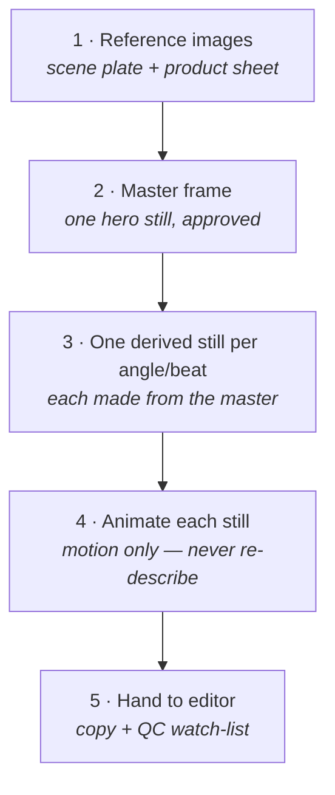

# Start Here

Welcome. This is the **Art Direction Engine** — a system for getting AI image and video tools to produce work that looks *art-directed* (distinctive, consistent, on-brand) instead of looking like default AI output. This page gets you oriented in about ten minutes. You don't need to read all eight documents to start.

---

## What you'll be able to do

- Invent a **distinctive visual direction** for any brand or campaign — not adjective-soup, an actual position.
- Turn it into a **reusable Profile** that retargets the whole system.
- Generate **statics** and **multi-shot videos** where the product, character, and world stay consistent across every frame.
- Output a deliverable a **non-technical person can run top-to-bottom** — copy this prompt, paste it here, attach that.

---

## The mental model (read this once)

Think of it as a machine with **four swappable slots**:

1. **The look** → the *Art Direction Profile* ([Doc 01](docs/01_Art_Direction_Profile_TEMPLATE.md)). The only brand-specific file. Swap it, and everything else retargets to the new brand.
2. **The mechanics** → the *Core Grammar* ([02](docs/02_Core_Prompt_Grammar.md)) and *Consistency / Asset Bible* ([03](docs/03_Consistency_and_Asset_Bible.md)). Brand-neutral, always the same.
3. **The output type** → *Statics* ([04](docs/04_Statics_Module.md)) or *Video* ([05](docs/05_Video_Scene_Module.md)). Pick one per job.
4. **The engine** → *Engine Adapters* ([06](docs/06_Engine_Adapters.md)). The final translation into the syntax of the specific tool you're using.

The behavioural rules that hold it all together — clean output by default, return variants, never revert to generic, format for one engine — live in the *Operating Contract* ([Doc 00](docs/00_System_Operating_Contract.md)).

---

## Two non-negotiable rules (the ones everyone breaks)

These are the most common ways AI output goes generic. The whole system enforces them:

1. **Negative space is never a flat white box.** The area you reserve for copy is a *defocused, in-palette continuation of the actual scene* (a soft-shadowed wall, an out-of-focus stretch of the set). White space is a failure. → [Grammar §3](docs/02_Core_Prompt_Grammar.md)
2. **Scale is explicit, never assumed.** Every hero object is sized against a real-world measurement and an in-frame anchor, so it doesn't change size between shots. → [Grammar §4](docs/02_Core_Prompt_Grammar.md)

---

## The video production loop (the thing that makes video consistent)

A video model only keeps a product/world consistent for **what's already in the still you hand it** — it animates a frame, it can't invent a faithful product from text. So you never text-to-video the whole thing. You lock the look as **stills first**, then animate:

The hard parts (composition, asset, light, layout) get frozen into images you can see and approve, so the video model only has to solve motion. → [Video Module §5](docs/05_Video_Scene_Module.md)

---

## Your first 10 minutes

1. **Skim [Doc 00](docs/00_System_Operating_Contract.md) §1–§3** — how the modules fit and the run sequence (5 min).
2. **Read one complete example** — [`examples/worked_reel_EmberAndComb.md`](examples/worked_reel_EmberAndComb.md). This shows you the destination: what a finished, runnable deliverable looks like (3 min).
3. **Open the [Profile Template](docs/01_Art_Direction_Profile_TEMPLATE.md)** and look at the [filled example](examples/profile_EmberAndComb.md) beside it (2 min).

That's enough to start. Reach for 02–06 as you need them.

---

## Two ways to run it

### A. By hand
Fill a Profile (use the [Creation Guide](docs/01A_Art_Direction_Creation_Guide.md) to make it non-generic), then follow the run sequence in [Doc 00 §3](docs/00_System_Operating_Contract.md), assembling prompts with the Grammar and translating with the Engine Adapters.

### B. As an AI assistant (recommended)
Load the system into an LLM so it acts as your art director. It will ask which brand Profile, what output type, and which assets to keep consistent — then produce clean, runnable deliverables. → **[SETUP.md](SETUP.md) walks this through step-by-step** (creating the Profile, building the assistant, your first job). The short version:

**Claude Projects / custom GPT / Gemini Gem — same idea:**
1. Add to the assistant's knowledge: **Docs 00, 01 (your filled Profile), 02, 03, 06**, plus **04 or 05** depending on what you make most.
2. Paste the short system prompt from **[Doc 00 §5](docs/00_System_Operating_Contract.md)** as the custom instructions.
3. Start a chat: *"Profile = [brand]. Make me a [static / reel] for [thing]."* If your brief is thin, a good assistant will propose 2–3 directions before locking one.

> **Want to see it run right now?** A ready-made **[public Gemini Gem](https://gemini.google.com/gem/1CeNFZPOSowKmL3AuqklvStldXLLgCl2b?usp=sharing)** comes preloaded with the engine files and the Ember & Comb example Profile — open it and start asking. It's shared and editable by anyone, so use it as a demo; for your own brand, build a private assistant via [SETUP.md](SETUP.md).

> Tip: keep your real, filled brand Profiles in the gitignored `private/` folder (or outside the repo entirely) so they never get published.

---

## Where to go next

| If you want to… | Go to |
|---|---|
| Invent a strong direction from scratch | [01A · Creation Guide](docs/01A_Art_Direction_Creation_Guide.md) |
| Understand prompt structure, negative space, scale | [02 · Core Grammar](docs/02_Core_Prompt_Grammar.md) |
| Keep a product/character identical across shots | [03 · Consistency / Asset Bible](docs/03_Consistency_and_Asset_Bible.md) |
| Make a single image or a static series | [04 · Statics](docs/04_Statics_Module.md) |
| Make a multi-shot reel or scene | [05 · Video](docs/05_Video_Scene_Module.md) |
| Translate a prompt for a specific tool | [06 · Engine Adapters](docs/06_Engine_Adapters.md) |
| Put brand type on the image (or leave space for it) | [02 · Core Grammar §3a](docs/02_Core_Prompt_Grammar.md) + Profile Field 13 |
| Build your own assistant from scratch | [SETUP.md](SETUP.md) |
| See the whole thing done | [examples/](examples/) |

Now go open [Doc 00](docs/00_System_Operating_Contract.md).
